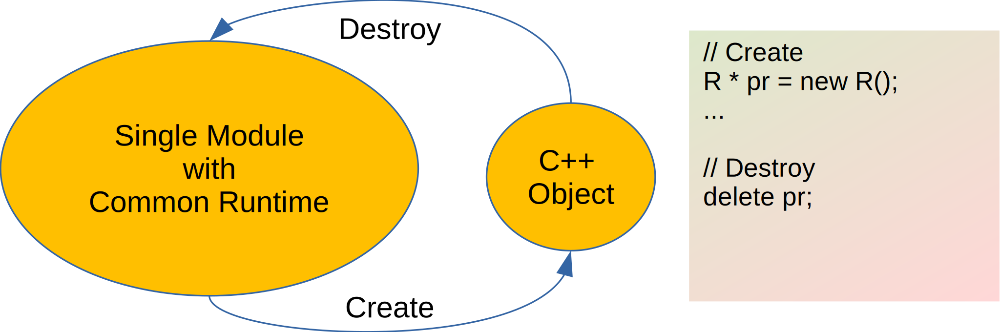
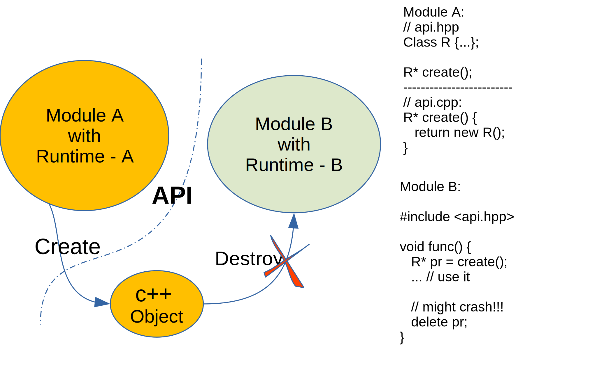
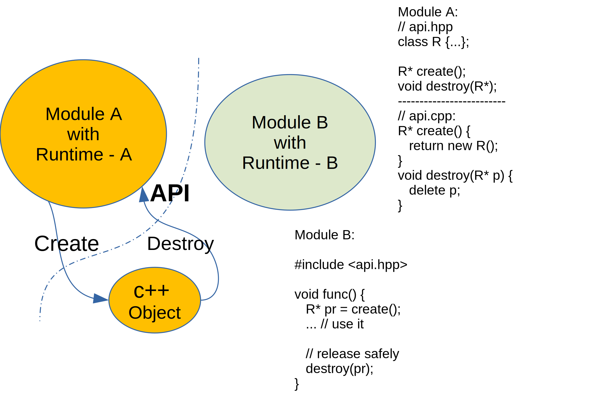
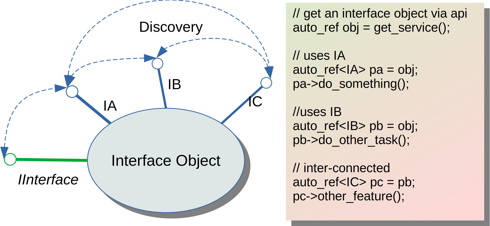
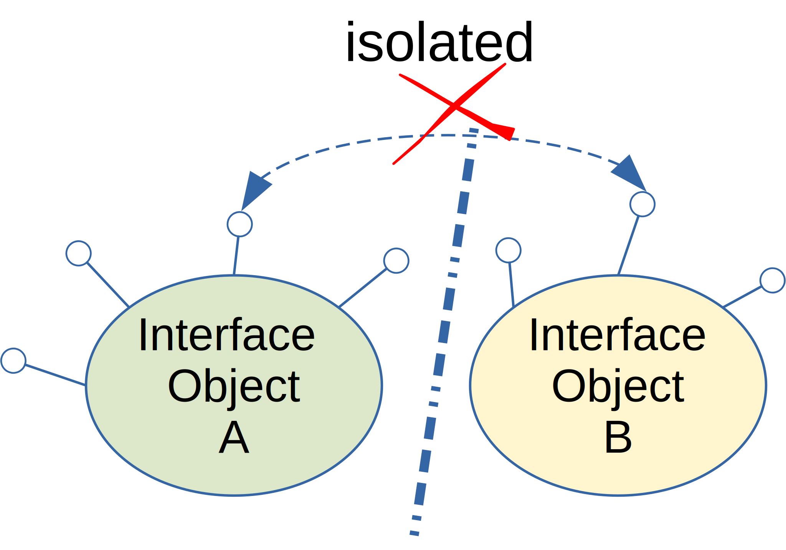
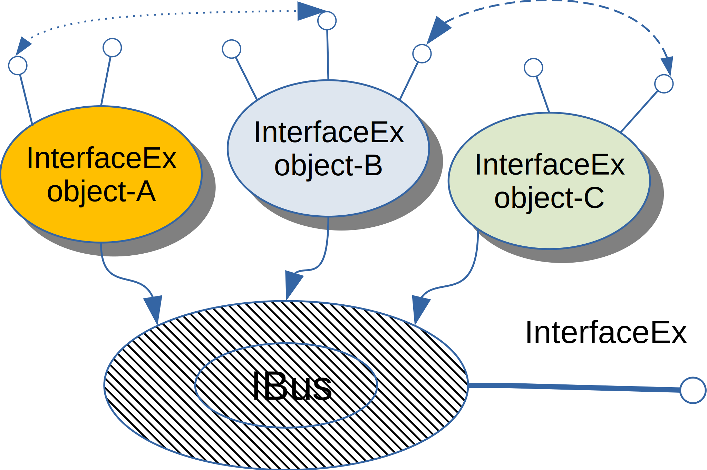
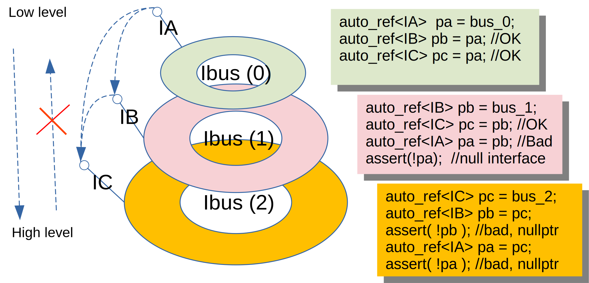
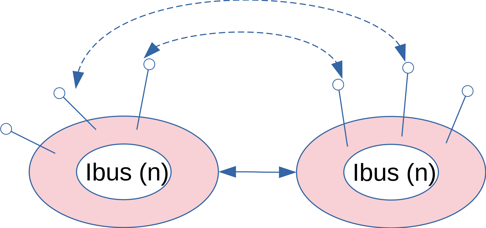

# Cross-Platform Utility Library (XP-UTIL)

This repository shares some c++ utility classes used in my own projects but can also be useful for other people to develop c++ applications on Windows, Linux and Mac.

## Compatibility

* C++20 for MSVC, Clang
* C++17 for GCC

## Install


## Usage


### OnExit: RAII Implementation

__"Resource acquisition is initialization"__ (RAII) is great for C++ to keep control the lifetime of a resource in the code manually. In standard library we have many built-in classes (such as std::unique_ptr<>, std::lock_guard, etc.) to help c++ programmers to manage shared resources. However, we might have to develop a RAII wrapper class for non-standard resource types, which is too tedious, boring and error-prone, this repeated micro-design efforts can be completely eliminated by a template-macro based facility demonstrated as following:

```c++
#include <xputil/on_exit.h>

Connection_t* conn = create_connection(...); //create a new connection to database
ON_EXIT(destroy_connection(conn));

// uses the connection
get_data(conn, params,...);

```

Another example is multi-stage-object-initialization. 

Assuming a complex c++ object with multiple resources will be created, we only want to return a valid instance to our api caller with all needed resources properly initialized. No resource leakage is allowed during the phrase of resources initialization.

The example is demonstrated by a _Car_ instance with one _Engine_ and several _Wheels_.  In the source code, we demonstrate how to create a new class instance with multiple internal resources allocated step by step. 

For each step, before allocating a new resource, an ON_EXIT() clause is declared to make sure the resource currently allocated can be released (revoked) properly if any unexpected error occurs to any _later_ steps. 

```c++
class EngineFactory {
public:
    static Engine* get(); //get a new engine, might throw if engine out-of-stock
    static void revoke(Engine* engine); //revoke an old engine for recycle
};

class WheelFactory {
public:
    static Wheel* get(); //get a new wheel, might throw if wheel out-of-stock
    static void revoke(Wheel* wheel); //revoke an old wheel for recycle
};

class Car {
public:
    //Returns a car instance with all resources properly initialized and self-test passed.
    static std::unique_ptr<Car> create(int total_wheels = 4){
        bool success {false};
        Car* car {nullptr};

        //step 0: allocate a "raw" car instance with no resouces allocated.
        ON_EXIT(
            if(!success && car) delete car;
        )
        Car* car = new Car();

        //step 2: allocate one engine for the car instance
        ON_EXIT(
            if(!success && car->engine_){ EngineFactory::revoke(car->engine_); }
        )
        car->engine_ = EngineFactory::get();

        //step 3: allocate all wheels
        ON_EXIT(
            if(!success){
                for(auto p: wheels_){
                    if(p) WheelFactory::revoke(p);
                }
            }
        );
        car->wheels.resize(total_wheels);
        for(int i = 0; i < total_wheels; ++i){
            car->wheels[i] = EngineFactory::get();
        }

        //Now that all resources are allocated successfully,
        //raise the SUCCESS flag only if the self-testing works fine.
        success = car->is_valid();
        return car;
    }
    ~Car(){
        EngineFactory::revoke(engine);
        for(auto p: wheels) EngineFactory::revoke(p);
    }

private:
    Car() = default; //initialize all resource pointers to nullptr by default.

    bool self_test_passed() const {
        ... //self-test logics
        return true;
    }

    bool is_valid() const {
        return engine  //engine is ok
            && std::all_of(std::begin(wheels), std::end(wheels), [](wheel* p){ return p != nullptr; }) //all wheels are ok
            && self_test_passed(); //all functions passed self-test.
    }

    //Resources
    Engine* engine_;
    std::vector<Wheel*> wheels_;
};
```

Without the ON_EXIT() facility, we might have to manually release the resources already allocated in the previous steps:

```c++

ResourceA *ra = allocate_resource_a();
if(ra == nullptr) throw std::runtime_error("Resource-A allocation error");

ResourceB *rb = allocate_resource_b();
if(rb == nullptr){
    free_resource_a(ra);
    throw std::runtime_error("Resource-B allocation error");
}

ResourceC *rc = allocate_resource_c();
if(rc == nullptr){
    free_resource_a(ra);
    free_resource_b(rb);
    throw std::runtime_error("Resource-C allocation error");
}

...

```
The source code will become messy and hard to maintain if the resource allocation logic is complex and there are many steps to complete, the allocate_xxx() / free_xxx() api callings must be matched to avoid resource leakage. 


The ON_EXIT() will greatly improve the code readibility, because whenever a resource is being allocated in the code, its lifetime control logic can be implemented inside a ON_EXIT() block nearby, defining the scope of resource and the way to release the resource, which make the code much more easy to maintain without unexpected resource leakage.  

```c++
{ //Begin ResourceA Scope
    ResourceA* ra = allocate_resource_a();
    ON_EXIT(
        ... //resource free logic
        if(must_release_resource_a()){
            free_resource_a(ra);
        }
    );
    ... //use Resource-A
    //
    { //Begin Resource-B Scope
        ResourceB* rb = allocate_resource_b();
        ON_EXIT(
            ... //resource free logic
            if(must_release_resource_b()){
                free_resource_b(rb);
            }
        );

        //Both resource-A and resource-B are available
        ...

    } //End Resource-B Scope
} //End of Resource A Scope

```

References:


[C.41: A constructor should create a fully initialized object](http://isocpp.github.io/CppCoreGuidelines/CppCoreGuidelines#c41-a-constructor-should-create-a-fully-initialized-object);
[R.1: Manage resources automatically using resource handles and RAII (Resource Acquisition Is Initialization)](http://isocpp.github.io/CppCoreGuidelines/CppCoreGuidelines#r1-manage-resources-automatically-using-resource-handles-and-raii-resource-acquisition-is-initialization);

### INTERFACE PROGRAMMING


In xputil, we have implemented a subsystem for interface define, implementation, cluster and discovery. 

First let's review what the interface based programming looks like, and why the interface programming can help improve the code partition of a middle to large c++ project.  

#### Interface-based Design
Interface-based programming is a very important infrastructure in OOP languages. An interface specifies a small set of behavior that an object should expose to the public; A class can implement
multiple independent interfaces. 

In _Go_, you can specify an interface via a built-in keyword _interface_:

```go
type IBark interface {
    bark()
}
type IRun interface {
    run()
}

type Dog struct {
}

func (inst* Dog) bark() {
    fmt.Println("dog barks!")
}
func (inst* Dog) run() {
    fmt.Println("dog can run")
}
``` 

In _Object Pascal_ (Delphi, Free-Pascal), the __Interface__ is also a built-in element:

```pascal
Type

IBark = Interface
    procedure bark;
end;

IRun = Interface
    procedure run;
end;

Dog = class(TInterfacedObject, IBark, IRun)
  procedure bark;  
  procedure run;  
end;

Implementation

procedure Dog.bark;
begin
   writeln("dog barks!");
end;

procedure Dog.run;
begin
   writeln("dog can run.");
end;
```

In C++, there is no such a built-in __interface__ keyword (MSVC does have non-standard ["__interface"](https://docs.microsoft.com/en-us/cpp/cpp/interface?redirectedfrom=MSDN&view=msvc-170) keyword for COM-related development) but its functionality can be implemented using pure abstract class.

```c++
struct IBark {
  virtual void bark() = 0;
};
struct IRun {
  virtual void run() = 0;
};

class Dog: public IBark, public IRun {
public:
    void bark() overload {
        printf("dog barks!\n");
    }
    void run() overload {
        printf("dog can run.\n");
    }
};
```

In the C++ guide line, there is a section talking about the interface based design:
[C.129: When designing a class hierarchy, distinguish between implementation inheritance and interface inheritance](http://isocpp.github.io/CppCoreGuidelines/CppCoreGuidelines#c129-when-designing-a-class-hierarchy-distinguish-between-implementation-inheritance-and-interface-inheritance)

The basic advantage of interface programming is __API abstraction__: the API and its implementation is 
completely isolated, as a result a software component implementing a well-known interface can be replaced or upgraded without breaking all of the exiting client codes.

However, with modern C++ template programming becomes more popular and powerful, An interface can also be implemented as a _contract_ or _concept_, which makes a class composible, reusable with minimum or flatten class hierarchy depth, the performance can also be improved by eliminating the virtual function overloading process at runtime.


Now that we know interface programming is very helpful, let's go a step further to talk about what kind of features are possibly needed to support the interface programming, and how XPUTIL can provide a simple solution for each problem.

#### Interface Definition and Implementation

For a simple c++ project where all source files are compiled into a single library or executable, interface can be implemented just like the Dog::IBark, Dog::IRun demo code, the compiler can see all of the interface implementations and all of the c++ object instances are managed by the same runtime context (memory pool, process heap, etc.).



The life time control of interface objects becomes complicated for a middle to large size of project which have many software submodules, binary plugins. The interface-based programming can be a great fit in this scenerio to decouple the implementation of components via a set of well known interfaces.

However, in the multiple modules software, the API design must be very careful to avoid unexpected behaviors, such as object lifetime control across module boundary.



The resource is allocated in module-A but try to be released in module-B, which is unsafe because a c++ object can be managed in a customized memory pool or heap, the two software modules are compiled binaries that might not share the same process heap. In some OS different threads might have different heap, On Symbian, for example, each thread comes with its own heap. In Windows you can also allocate object in different heaps, since Module-B has no control of the runtime context of module-A, the across-boundary c++ object release does not make any sense and will most likely cause unexpected behavior!

To fix the issue, we must make sure a c++ object must be managed by the same module (runtime context), so at the API layer both object create and object release functions must be provided for public access by external modules:




Based on this observation the destructor of c++ class implementing an interface should be protected or private to avoid direct object deletion in the local runtime context.

On the other hand, a c++ interface object returned from a module might be shared by many clients, so the direct api calling to destroy an interface object is also not safe, its lifetime management must be implemented in a consistent way, that's why _XPUTIL_ uses a reference count based scheme.


In Module-A, the interface is declared and published in its api header file "intf_bark.h":

```c++
// module_a/intf_bark.h

#include <xputil/intf_defs.h>

struct IBark: public xp::IRefObj {
    virtual void bark() = 0;
};

IBark * create_bark();
```

The implementation unit in module-A looks like:

```c++
// module_a/impl_bark.cpp:
#include <xputil/impl_intfs.h>
#include "intf_bark.h"

IBark* create_bark(){
    return xp::make_ref<IBark>();
}

```


On the client side (module-B), we can call the module-a's api to retrieve an IBark interface object:

```c++
#include <module_a/intf_bark.h>

void func() {
    xp::auto_ref pr = create_bark();
    pr->bark();
}
```

The __xp::auto_ref<T>__ helper class is a RAII wrapper to increase / decrease the reference count of an interface object automatically on the client side, the lifetime of an interface object is fully managed in the runtime context of its source module, as a result the potential resource leakage and cross-boundary c++ object destruction issue are resolved gracefully. 


#### Interface Publish and Discovery

In the previous section we talk about the basics of interface programming and how to safely implement a c++ interface object in a multi-modules project. 

For a large project, there can be many interfaces implemented by different plugins or submodules, we have to figure out a systematic way to manage all of the active interfaces efficiently.

1. Publish: An interface object can be published both at compiling time and at run-time; 
  You can register built-in interface objects in the source code, or register the interface objects implemented by any external plugins at runtime.
2. Discover: An active interface object can be easily discovered and used by other software modules;
  An interface registered in the system can be resolved at runtime on demand. 
3. Accessibility: An interface can only be seen and accessed by some submodules;
  The low-level apis implementing kernel features should not be visible to the high-level software modules for security reason. The interfaces
  must be grouped with different security ranks.
4. Extensibility: Interface can be replaced or upgraded with zero or minimum code change on the client modules.

The design of _XP-UTIL_ has provided solutions for all of the requirements.

##### Interface Publish


To make a public interface discoverable we must assign an unique id to it:

```c++
#include <xputil/intf_defs.h>

struct IBark: public xp::IInterface {
    DECLARE_IID("myapp.IBark.1");
    virtual void bark() = 0;
};

struct IRun: public xp::IInterface {
    DECLARE_IID("myapp.IRun.1");
    virtual void run() = 0;
};
```

By inheriting a new interface from xp::IInterface, the interface class can be assigned an unique string id using the macro __DECLARE_IID__:

```c++
DECLARE_IID(any_unique_string);
```
The interface IID can be __any__ string unique to your application, in the above example, the iid name pattern is: 
```
 {app_name}.{interface_name}.{interface_version}
```
Actually it is also perfect to use a GUID like this:

```
DECLARE_IID("b8cfad5f-a072-4a7c-8ce7-a8086702c068");
```

The interface unique id can be retrieved by macro "IID":

```c++
assert( IID(IBark) == "myapp.IBark.1");
```

An publishable objects with multiple interfaces can be implemented as follows:

```c++
#include <xputil/impl_intfs.h>

class Dog: public xp::TInterfaceBase<IBark, IRun>
{
public:
    Dog(const char* name):name_(name){}
    //IBark
    void bark() overload {
        printf("dog(%s) barks!", name_.c_str());
    }
    //IRun
    void run() overload {
        printf("dog(%s) run.", name_.c_str());
    }
private:
    std::string name_;
};

auto dog = new Dog("Spike");
```

Given a dog interface object, you can query a specified interface as follows:

```c++
{ //obj => interface
    xp::auto_ref<IBark> x = dog;
    assert(x);
    x->bark();
}
{ //obj => interface
    xp::auto_ref<IRun> y = dog;
    assert(y);
    y->run();
}
{ //interface => interface
    xp::auto_ref<IBark> x = dog;
    //now we have a IBark interface, we can navigate to another interface
    xp::auto_ref<IRun> y = x;
    assert(y);
}
```


As you can see, all of the interfaces implemented by an interface object are inter-connected, interface navigation becomes so easy in xputil.
If you are developing a software module with 10 features implemented in 10 different interfaces, instead of publishing 10 features in 10 public apis (the traditional way), you can simply publish one api:

```c++
// module_services.hpp
struct IFeature1: public xp::IInterface {...};
struct IFeature2: public xp::IInterface {...};
...
struct IFeature10: public xp::IInterface {...};

IInterface* get_module_services();
```
Then the clients can query needed feature sets on demand in the same pattern:

```c++
#include <module_services.hpp>
//client code
xp::auto_ref feature_xxx = get_module_services();
feature_xxx->do_whatever();
```

If a feature is not supported, you can fallback to another interface or just abort with an error message:
```c++
xp::auto_ref feature_8 = get_module_services();
if(!feature_8){
    std::cerr << "feature 8 not supported by the sub-module";
    return -1;   
}
feature_8->do_whatever();
```
Basically the API management becomes quite simple for the module development, you have __one__ generic stable public api, the api clients won't break after the module upgrade as long as you keep the behavior of published interfaces untouched. 

##### Interface Bus

In the previous section we have explained how the interface object can simplify the public api of a software module, and the interfaces implemented by a single interface object are completely interconnected.

However, for a project with many modules and multiple interfaces, you cannot implement all interfaces in a single interface object, you have to support subsets of interfaces with multiple interface objects, the interface of object A cannot navigate to interface of object B, and vice versa:



As a result we have some isolated interface islands left.

To overcome the disconnection problem, xputil introduces the concept of __interface bus__.

* Interface Bus (__IBus__): a special interface to connect, disconnect other interface objects;
* Bus-aware Interface (__IInterfaceEx__): any interface object that can be connected to a bus must inherit from IInterfaceEx. 

In module api header file, we declare all public interfaces and the one and only api function get_module_service() as usual:

```c++
//module_service.h
#include <xputil/intf_defs.h>

IInterface* get_module_service();

// public interfaces
struct IBark: public xp::IInterfaceEx {
    DECLARE_IID("myapp.IBark.1");
    virtual void bark() = 0;
};

struct IRun: public xp::IInterfaceEx {
    DECLARE_IID("myapp.IRun.1");
    virtual void run() = 0;
};
```

In the module's implementation units, we implements interfaces in different interface objects:

```c++
//module_service.cpp
#include <xputil/impl_intfs.h>
#include "module_service.h"

//one interface object with one interface
class Impl_Bark: public xp::TInterfaceEx<IBark> {
public:
    void bark() overload {}
};

class Impl_Run: public xp::TInterfaceEx<IRun> {
public:
    void run() overload {}
};
//one interface object with multiple interfaces
class MultiFeatures: public xp::TInterfaceBaseEx<IFeature1, IFeature2, ...> {
  ...
};

xp::auto_ref bus;

IInterface* get_module_service(){
    bus = new xp::TBus(0);

    //publish all interface objects implemeneted in this module.
    bus->connect(new Impl_Bark()); 
    bus->connect(new Impl_Run());
    bus->connect(new MultiFeatures());

    return bus.get();
}
```

As usual, the client code does not need to make any change, simply query an interface on demand:

```c++
//client code
#include <module-a/module_service.h>

xp::auto_ref<IBark> p = get_module_service();
p->bark();
// interface hopping (IBark => IFeature1)
xp::auto_ref<IFeature1> feature1 = p;
feature1->f1();
```



Once connected via bus, all interfaces supported by each interface objects are visible as if they are implemented by a single interface object.

It is also very important that an IBus interface is derived from IInterfaceEx, so a bus can be connected to another bus, as a result all interfaces connected on each bus are virtually merged into a big network.


##### Interface Accessibility

In a project with multiple interfaces, not all interfaces should have the same visibility, they can be partitioned into different groups and the accessibility of each group can be restricted, that's why the concept of "bus level" is introduced in _xputil_:

_Bus Level_ is a rank value of a bus. It is an integer number assigned to a bus when it is initialized:

```c++
xp::auto_ref<IBus> bus(new TBus(2)); //bus-level = 2
```
Bus Rules:

1. Bus with _small_ bus level has _more_ security, _higher_ priviledge and _wider_ visibility.


2. Bus with _equal_ bus level are _siblings_ and have the same security level, same visibility.



All interfaces on sibling buses are interconnected, one interface can hop to another with no restriction.

Notes on the connection api:

```c++
auto_ref<IBus> bus_0 = new TBus(0);
auto_ref<IBus> bus_1a = new TBus(1);
auto_ref<IBus> bus_1b = new TBus(1);

bool ok = bus_0->connect(bus_1); //OK
assert(ok);

ok = bus_1a->connect(bus_0); //BAD, input bus must have equal or high rank level.
assert(!ok);

ok = bus_1a->connect(bus_1b); //OK, sibling connection is allowed
assert(ok);
```

##### Interface Extensibility

Once an interface is published as a part of the product deployed to the customers, its api protocol must be frozen, all non-backward compatible improvements and new apis must be added to an interface with a new IID:

```c++
//first version #1
struct IBark_v1: public xp::IInterface {
    DECLARE_IID("myapp.IBark.1");
    virtual void bark() = 0;
};

//implementation
class Dog: public xp::TInterfaceExBase<IBark_v1> {
public:
    void bark() overload {...}
};

//publish
bus->connect(new Dog());
```

After the v1 is released, you add a new api to control the volume:
```c++
//second version #2
struct IBark_v2: public IBark_v1 {
    DECLARE_IID("myapp.IBark.2");
    virtual void set_volume(int volume) = 0;
};
//implementation
class Dog_v2: public xp::TInterfaceExBase<IBark_v2, IBark_v1> {
public:
    void bark() overload {...}
    void set_volume(int volume){...}
};

//publish
bus->connect(new Dog_v2()); //supports v1 and v2.
```
And after v2 is released, you decide to merge the existing apis into one:

```c++
//version #3
struct IBark_v3: public xp::IInterface {
    DECLARE_IID("myapp.IBark.3");
    virtual void bark_with_volume(int volume) = 0;
};
//implementation
class Dog_v3: public xp::TInterfaceExBase<IBark_v3> {
public:
    void bark_with_volume(int volume){...}
};

//publish
bus->connect(new Dog_v2()); //supports v1 and v2.
bus->connect(new Dog_v3()); //supports v3
```

On the client side, the old client still work fine with IBark::v1:
```c++
auto_ref<IBark_v1> p = get_service();
p->bark();
```

New clients can with with multiple versions of plugins:
```c++
bool try_bark(IInterface* srv)
{
    { //first try latest version 3.
        auto_ref<IBark_v3> p = srv;
        if(p) {
            p->bark_with_volume(80);
            return true;
        }
    }
    { //then try latest version 2.
        auto_ref<IBark_v2> p = srv;
        if(p) {
            p->set_volume(80);
            p->bark();
            return true;
        }
    }
    { //last try the first version
        auto_ref<IBark_v1> p = srv;
        if(p) {
            p->bark();
            return true;
        }
    }
    TRACE("IBark interface not found!");
    return false;
}
```
As you can see, the interface programming can help partition complex project into many small maintainable sub-modules, each of the submodule can be developed and upgraded without breaking existing codes.

#### Plugin Design Pattern

The interface programming can be a great choice for a software project with many extensible plugins.

In the main module (the main executable of the application), we can develop core features in bus level-0:

```c++
auto_ref<IBus> bus_core = new TBus(0);

bus_core->connect(new core_feature_1());
bus_core->connect(new core_feature_2());
bus_core->connect(new core_feature_3());
```

A second bus with level-1 is created to hosting interfaces provided by plugins:
```c++
auto_ref<IBus> bus_user = new TBus(1);
//optionally connect to bus-core so we can access all plugin interfaces from main module.
bus_core->connect(bus_user);
```

Optionally, the third bus with level-2 can be created to provide common utilities for all plugins:
```c++
// publish common utilities for all plugins
auto_ref<IBus> bus_util = new TBus(2);
bus_util->connect(new plugin_util_x());
bus_util->connect(new plugin_util_y());
bus_util->connect(new plugin_util_z());

bus_user->connect(bus_util);
```


All app plugins must have an entry point api:
```c++
using plugin_entry_t = int (*)(IBus* bus);
```

Basically it accepts an IBus* parameter and returns an error code.

A typical plugin entry looks like:

```c++
xp::auto_ref<IPlugin_util_x> util_x;

int plugin_entry(IBus* bus)
{
    util_x = bus; //extract utilities from main module
    if(!x) return -1; //too bad, utility-x not resolved, abort.

    //publish my own services
    bus->connect(new my_service_a());
    bus->connect(new my_service_b());
    bus->connect(new my_service_c());
    
    return 0; //success
}
```

When app launching, it searchs the plugin directories and tries to load and initialize a plugin by calling its plugin-entry api:

```c++
for_each(module: modules){
    if(!module.plugin_entry(bus_user)){
        TRACE("module initialize success!");
    }
}
```

In this plugin design, the main system uses bus-user (level-2) to connect external interfaces from plugins, so that the kernel interfaces (on bus-core) are not accessible by plugins, but the common utilities can be shared by all plugins, a plugin can extract needed utility interfaces from bus-user, and publish its own interfaces on bus-user. The only public api needed is the _plugin_entry_ function.

#### ABI Compability

Because the c++ interface is declared as pure c++ class, the __VTable__ layout and binary compatibility of different compilers are not guaranteed. For GCC, the ABI compatibility between different versions is great because it saves the source order of virtual functions in VTable. For MSVC, the V-Table layout is different from GCC at the binary level, so for best ABI compatibility, please do not mix binaries compiled by different compilers in a project deployment, it does not work. Always use the same compiler (GCC, MSVC, Clang, etc.) to build all modules.

#### COM Compability

Adapter class can be developed to convert COM interface as a C++ interface. 
#### Delphi Interface Compability

Delphi has its own interface, adapter classes are developed to convert delphi interface object as c++ interface object, and vice versa.

